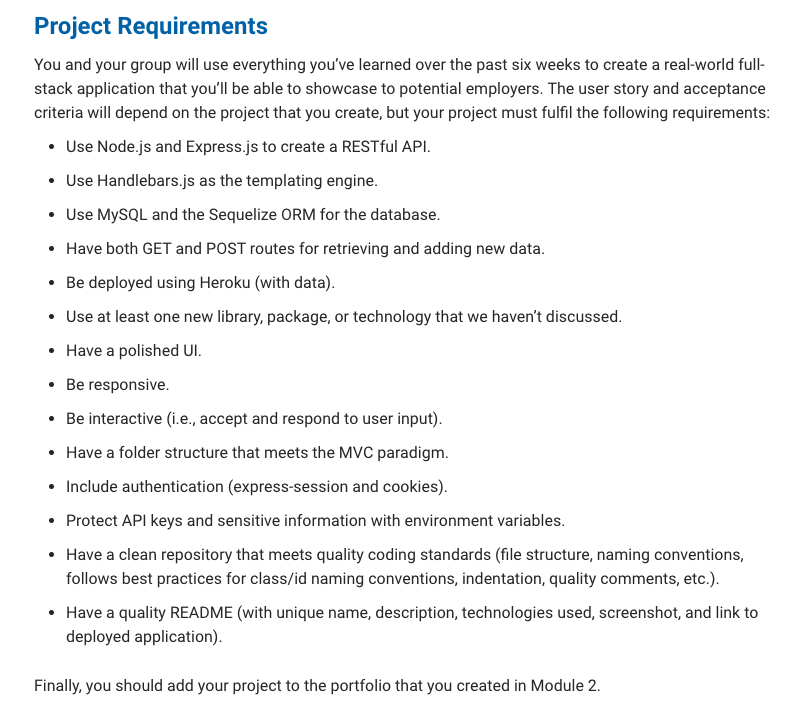

# Quotely 

Get inspred and motivated by Quotes!

## Description

Quotely is an interactive dynamical application. As the name suugest this is a "Quote" app. In this app you can find various quotes from various authors. 

User Story / Project Requirements 

## Summary

Quotely is an Quote app where you can find various quotes from various authors. You can create your own dashboard and save your favorite quotes. You can get inspired from well said quotes. Also if you change your mind and want to delete the previous quote and open up space for the new quote in your dashboard, that is possible by clicking the delete button. 

## License

MIT License

## Deployed Page 

https://quotely-22947f0a031d.herokuapp.com/ 

## Contributors 

Dilek  - https://github.com/dileknrdn 

Luke  - https://github.com/StrolineDigital

Thomas  - https://github.com/Neglon 

